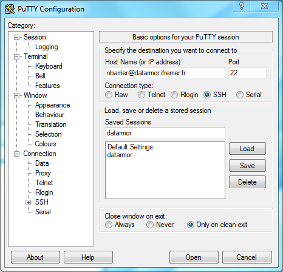
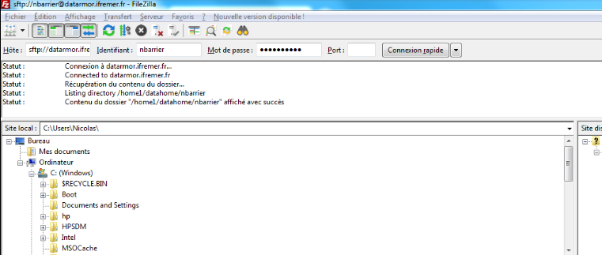

Documentation Datarmor
==========================

# Connection

## Windows

Connection via [Putty](https://www.putty.org/) (login + mdp intranet
ifremer)



<!-- Echange de donnees via [FileZilla](https://filezilla-project.org/).


-->

## Linux / Mac Os X

Connection et echange possible via Putty, mais aussi via le terminal:

``` {.csh language="csh"}
# connexion (login + mdp intranet ifremer)
ssh nbarrier@datarmor.ifremer.fr
```

Pour se connecter a la machine sans mot de passe, il faut utiliser un chiffrage RSA:

``` {.csh language="csh"}
# generate a RSA public/private key pair
# if you have one, skip this step
ssh-keygen  

# send the key to your datarmor account
ssh-copy-id nbarrier@datarmor.ifremer.fr
```

# Dossiers importants

Les dossiers importants sont:

-   `$HOME`: dossier de travail (50 Mo, sauvegarde). Pour les codes et
    les choses importantes

-   `$DATAWORK`: espace de travail, plus d'espace, non sauvegarde (pour
    les donnees)

-   `$SCRATCH`: espace temporaire utilise pour faire tourner les
    modeles. Grosse memoire, mais effacee de maniere reguliere (ne rien
    y laisser)

En general, les jobs doivent tourner sur `$SCRACTH`, apres y avoir copie
les codes depuis `$HOME` et les donnees depuis `$SCRATCH`. Mais
possibilite de faire tourner les codes depuis `$DATAWORK` directement.

# Modules

Pour lister les differents modules disponibles:

``` {.csh language="csh"}
    module avail
```

Pour lister les differents modules de charges:

``` {.csh language="csh"}
    module list
```

Pour charger un module:

``` {.csh language="csh"}
    module load R   # charge un module
    module load java NETCDF  #  charge 2 modules a la fois
    module load vacumm/3.4.0-intel   # charge une version specifique
```

Pour desactiver un module:

``` {.csh language="csh"}
    module unload R
```

Pour enlever tous les modules charges:

``` {.csh language="csh"}
    module purge
```

# Reglages par default

Pour changer le comportement par default, il faut creer/editer le
fichier `${HOME}/.cshrc`.

On peut soit ajouter de nouveaux raccourcis (alias) soit changer le comportement
par defaut de certaines commandes

        # nouveaux raccourcis
        alias x 'exit'
        alias c 'clear'
        
        # remplacer le comportement par defaut
        # evite l'ecrasement de fichiers existant lors
        # des copies/renommage/deplacements et effacements
        alias rm 'rm -i -v'
        alias cp 'cp -i -v -p'
        alias mv 'mv -i -v'

On peut aussi definir des variables d'environnement supplementaires (par
exemple lieu d'installation des librairies R):

        setenv R_LIBS_USER $HOME/libs/R/lib

# Lancement de Job

Des exemples de scripts de lancement de jobs se trouvent dans le dossier
datarmor `/appli/services/exemples/`

## Interactif

Pour se connecter de maniere interactive sur un noeud de calcul, il faut
taper dans le terminal:

``` {.csh language="csh"}
qsub -I -l walltime=30:00:00 -lmem=100g
```

L'argument `-lmem` specifie la memoire demandee, l'argument
`-l walltime` le temps de calcul demande.

## Bash mode

Pour faire tourner des codes de maniere non interactive, il faut ecrire
un script de lancement de job, qui sera lance avec la commande `qsub`:

``` {.csh language="csh"}
qsub run_script.pbs
```

Les sorties du job seront mises dans le fichier `run_script.pbs.oXXXX`,
avec `XXXX` l'identification du job.

Des exemples sont fournis par datarmor dans le dossier
`/appli/services/exemples/` (dossiers `R` et `pbs`). Deux exemples sont
fournis ci-dessous, un en CSH (le default de Dataror) et un autre en
BASH.

Script en CSH:

``` {.csh language="csh"}
#!/bin/csh
#PBS -l mem=1g
#PBS -l walltime=00:30:00

# First line defines the memory used
# Second line defines the "walltime" (if time > walltime, job is killed)

# go to the directory where the job has been run
# cd $PBS_O_WORKDIR

# copy the code into the SCRATCH dir
cp -pr $HOME/code $SCRACTH
# copy the input data into the SCRATCH dir
cp -pr $DATAWORK/data $SCRACTH
# move to the SCRATCH directory
cd $SCRATCH

# Load the modules that will be used to do the job
source /usr/share/Modules/3.2.10/init/csh
module load R

# indique ou trouver les librairies R installees a la main.
setenv R_LIBS $HOME/libs/R/lib

# Run R
date
time R --vanilla < script.R >& output.log  # redirects outputs into log
# time R --vanilla < script.R >   # in this case, outputs will be in 
date
```

\vspace{1em}
Script en BASH:

``` {.bash language="bash"}
#!/bin/bash
#PBS -l mem=1g
#PBS -l walltime=00:30:00

# First line defines the memory used
# Second line defines the "walltime" (if time > walltime, job is killed)

# go to the directory where the job has been run
# cd $PBS_O_WORKDIR

# copy the code into the SCRATCH dir
cp -pr $HOME/code $SCRACTH
# copy the input data into the SCRATCH dir
cp -pr $DATAWORK/data $SCRACTH
# move to the SCRATCH directory
cd $SCRATCH

# Load the modules that will be used to do the job
source /usr/share/Modules/3.2.10/init/bash
module load R

# indique ou trouver les librairies R installees a la main.
export R_LIBS=$HOME/libs/R/lib

# Run R
date
time R --vanilla < script.R > output.log 2>&1  # redirects outputs into log
# time R --vanilla < script.R >   # in this case, outputs will be in 
date
```

\vspace{1em}
Commandes utiles pour suivre les jobs:

``` {.csh language="csh"}
    # suivi des jobs pour un utilisateur donne
    qstat -u nbarrier
    
    # supprimer un JOB
    qdel JOB_ID   # job ID est fourni par qstat
```

Le premier argument est le nom du dossier Datarmor que vous voulez
monter, le deuxieme est le dossier destination dans lequel ce montage
sera fait.

# External Data Exchange

To exchange heavy data from outside the Ifremer Network, you need to
have a `$SCRATCH/eftp` directory on your datarmor account.

Move to the source/destination directory.

Then, connect to the FTP as follows:

    ftp eftp.ifremer.fr

Connect using your extranet account. Then:

    cd scratch   # WARNING, DON'T FORGET!

    prompt  # activate/deactivate interactive mode

    get file.nc  # send $SCRATCH/eftp/file.nc to the local directory

    mget *  # send all files in $SCRATCH/eftp/ to the local directory
    put file.nc  # send local file.nc to the $SCRATCH/eftp/
    mput *  # send all files in local directory to the $SCRATCH/eftp/
    
 # Setting up software environment
 
 
  
