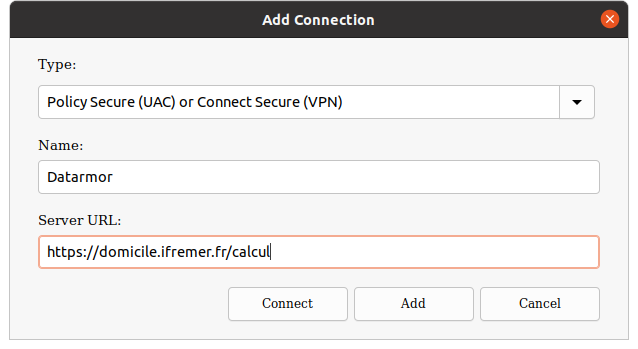
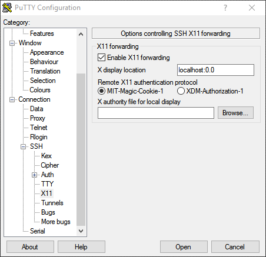
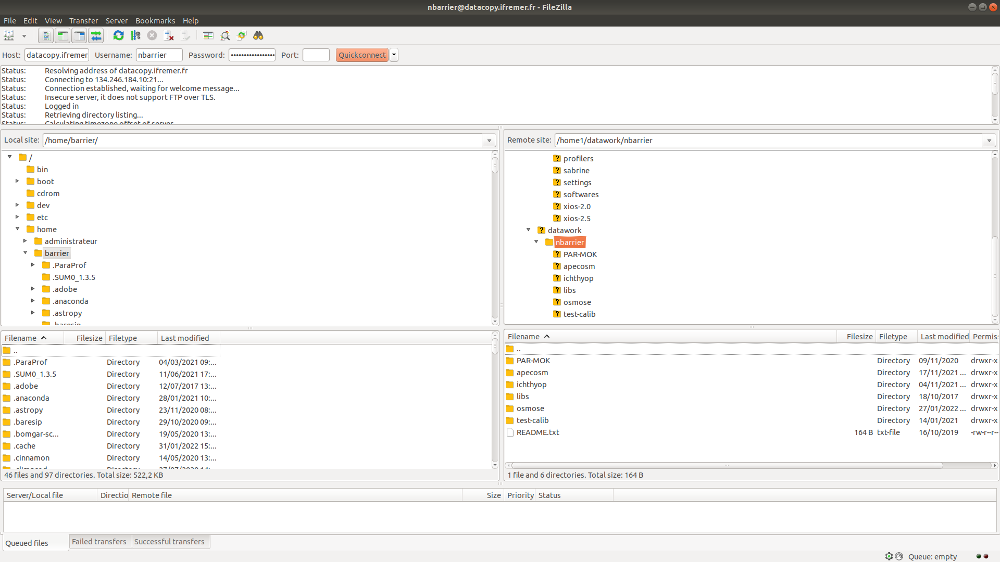
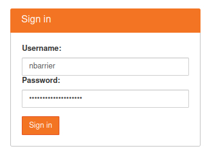
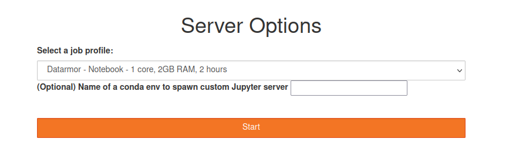
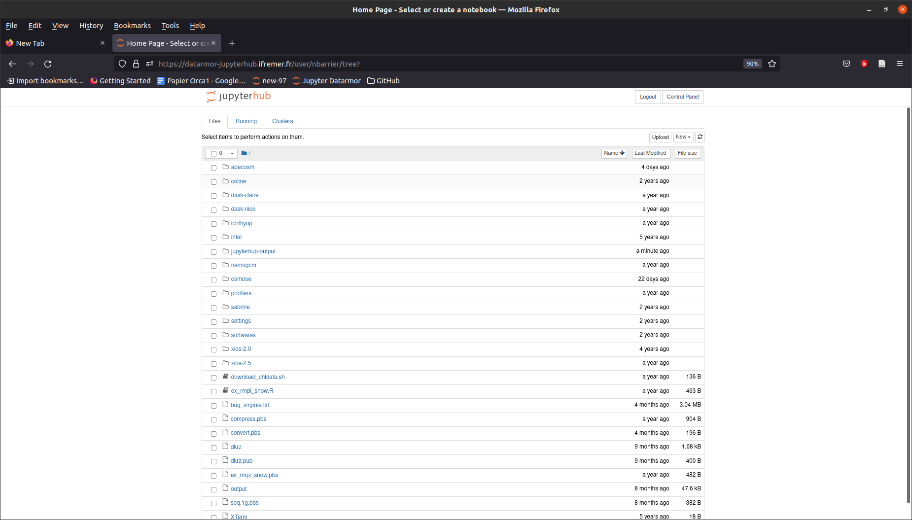

# Datarmor Training

## Nicolas Barrier ([nicolas.barrier@ird.fr](mailto:nicolas.barrier@ird.fr))

---

# What is Datarmor?

Datarmor is a High-Performance Computer (HPC): 
- CPU : 11088 cores (My PC: 12 cores)
- RAM: 128 Go (My PC: 32 Go)
- Storage: 5 Po = 5000 To (My PC: 1 To).
- Hosting of web services (Jupyter Notebooks, visualuzation nodes)

Source: [Ifremer](https://domicile.ifremer.fr/intraric/Mon-IntraRIC/Calcul-et-donnees-scientifiques/,DanaInfo=w3z.ifremer.fr,SSL+Qu-est-ce-que-Datarmor)

---

# Pulse Secure: install

Outside the Ifremer Network, PulseSecure is required. It can be downloaded [here](https://domicile.ifremer.fr/index.php/s/WC9GArY8Eo51yZE/,DanaInfo=cloud.ifremer.fr,SSL+download?path=\%2F&files). 

Install the right version depending on your OS:

- Windows 64: `PulseSecure.x86.msi`
- Mac Os X 64: `PulseSecure.dmg`
- Ubuntu 20.04: `pulsesecure_9.1.R12_amd64.deb`
- Ubuntu 18.04: `pulse-9.1R8.x86_64.deb`

---

# Pulse Secure: set-up

Now set-up a new connection as follows:

<div align="center">
    
</div>

Connect to the Datarmor VPN using your **extranet** logins.

---
# Connection: Terminal (Linux / Mac Os X)

For Linux/Mac Os X users, open a Terminal and types:
 
```
ssh -X nbarrier@datarmor.ifremer.fr
```

replacing `nbarrier` by your **intranet** login. The `-X` option allows display (for use of text editors for instance).


> For Mac Os X users, I recommend to install and use [iTerm2](https://iterm2.com/) Terminal application, which is more user friendly than the default one.

---

# RSA keys (Linux / Mac Os X)

To connect on Datarmor without typing the password, you need to use a RSA key. First, check if one already exists:

``` {.csh language="csh"}
ls $HOME/.ssh/id_rsa.pub
```

If no such file, generate a key using

``` {.csh language="csh"}
ssh-keygen  
```

and follows instructions. Then, send it to Datarmor:

```
ssh-copy-id nbarrier@datarmor.ifremer.fr
```

---


# Connection: Putty (Windows)

For Windows Users, it is recommended to use [Putty](https://www.chiark.greenend.org.uk/~sgtatham/putty/latest.html) 

<div align="center">
    
</div>

---

# Connection: Putty (Windows)

To allow display, you need to enable X11 forwarding on the `Connection > SSH` menu:

<div align="center">
    
</div>

---

# Navigating on Datarmor

Datarmor is a Unix computer. You need some Linux background.

- Change directory: `cd my/new/directory`
- Go to parent directory: `cd ..`
- Create new folder: `mkdir -p folder_name`
- Copy a file: `cp file.txt save_file.txt`
- Rename/Move a file: `mv file.text my/dest/renamed.txt`

Visit [linux-commands-cheat-sheet](https://linoxide.com/linux-commands-cheat-sheet/) for a summary of essentials Linux commands.


---


# Important folders

Important folders are:

-   `$HOME`: main folder (50 Mo, backed-up). For codes and important things
-   `$DATAWORK`: data folder (1 To, **no back-up**).
-   `$SCRATCH`: temporary folder (10 To, files older than 10 days are automatically removed). Used to run the computation.

In general, computation should follow these steps: 
- Copy codes from `$HOME` to `$SCRATCH`
- Copy data from `$DATAWORK` to `$SCRATCH`
- Go to `$SCRATCH` and run the computation
- Copy output files from `$SCRATCH` to `$DATAWORK`

---

# Modules (1/2)

To work with external tools, you need to load them into Datarmor's memory. This is done as follows:

``` {.csh language="csh"}
module load R   # load one module
module load java NETCDF  #  load 2 modules
module load vacumm/3.4.0-intel  # load a specific version
```

To list all the available modules:

``` {.csh language="csh"}
module avail
```

To list the modules that you use:

``` {.csh language="csh"}
module list
```


---

# Modules (2/2)


To deactivate a module:

``` {.csh language="csh"}
module unload R
```

To unload all the modules at once:

``` {.csh language="csh"}
module purge
```

---

# Default settings (1/2)

To change some default behaviours, you need to create/edit the Linux configuration file.

This can be done as follows:

```
gedit ${HOME}/.cshrc &
```

> The `&` character implies that you will keep access to your terminal. Else, the terminal will be back once the text editor is closed.

---

# Default settings (2/2)

In the `.cshrc` file, you can define new shortcuts:

```{.csh language="csh"}
alias x 'exit'
alias rm 'rm -i -v'
alias cp 'cp -i -v -p'
alias mv 'mv -i -v'
```

You can also create environment variables:

```{.csh language="csh"}
setenv R_LIBS_USER $HOME/libs/R/lib
```

Now, you can access the above folder using `cd $R_LIBS_USER`

You can also load your favorite modules in here:

```
module load NETCDF
```

---

# Running a calculation

When you connect on Datarmor, you are on the **login node**.  It is used to navigate, manipulate small files, eventually compile the codes.

**But absolutely no computation or heavy file manipulation should be done from here!!!**

To switch to a compute node, you need to create a PBS job using the `qsub` command.

---

# Running a job: interactive mode.

To run a sequential, interactive job, type the following:

``` {.csh language="csh"}
qsub -I -l walltime=30:00:00 -l mem=100g
```

The `-l mem` specifies the requested memory, `-l walltime` specifies the requested calculation time.

Sequential jobs can be used to move/copy heavy data files (movies, model forcings, model outputs, etc.) from one place to another.

---

# Running a job: PBS script

To run a job in a non-interactive way, you need to create a `.pbs` file, which contains the instructions for running your job.

When done, run the calculation as follows:

``` {.csh language="csh"}
qsub run_script.pbs
```

Job output files will be provided in a `run_script.pbs.oXXXX` file, with `XXXX` the job ID.

Some examples are provided in Datarmor's `/appli/services/exemples/` folder (see the `R` and `pbs` sub-folders).

---

# Running a job: PBS script (sequential)

``` {.csh language="csh"}
#!/bin/csh
#PBS -l mem=10Mo
#PBS -l walltime=00:00:05

# Load the modules that will be used to do the job
source /usr/share/Modules/3.2.10/init/csh
module load R

# go to the directory where the job has been run
cd $PBS_O_WORKDIR

cat > script.R <<EOF
x = c(1, 2, 3, 4)
print(x)
EOF

# Run R
Rscript script.R >& output.log  # redirects outputs into log
```

---

# Running a job: PBS script (parallel)

Parallel jobs are run in the same way, except that a queue (`-q`) parameter is added. It specifies the number of **nodes** that you use. 1 node is 28 cores.

``` {.bash language="csh"}
#!/bin/csh
#PBS -l mem=10Mo
#PBS -q mpi_2
#PBS -l walltime=00:05:00
cd $PBS_O_WORKDIR

source /usr/share/Modules/3.2.10/init/csh
module load NETCDF/4.3.3.1-mpt-intel2016

date
time $MPI_LAUNCH program.exe >& out
date
```

So here, the program uses 48 cores in total.

---

# Datarmor queues

The full description of Datarmor queues is provided [here](https://domicile.ifremer.fr/intraric/Mon-IntraRIC/Calcul-et-donnees-scientifiques/Datarmor-Calcul-et-Donnees/Datarmor-calcul-et-programmes/,DanaInfo=w3z.ifremer.fr,SSL+Queues-d-execution-PBS-Configuration-detaillee). Most important ones are:
- `sequentiel`: the default one (single core)
- `omp`: shared-memory queue (several nodes with access to the same memory).
- `mpi_N`: distributed memory queue (several nodes with independent memories), with `N` ranging from 1 (28 cores) to 18 (504 cores)
- `big`: distributed memory with 1008 cores.
- `ftp`: queue used to upload/download data to/from remote FTP servers
- `gpuq`: GPU queue.

---

# Following your jobs

To follow the status of your job:

``` {.csh language="csh"}
qstat -u nbarrier
```

To suppress a job:

``` {.csh language="csh"}
qdel JOB_ID 
```

At the end of the job, check the email you receive and look for the following lines:

```
resources_used.mem=12336kb
resources_used.walltime=00:00:24
```

If you requested more memory/walltime than you used, adapt your needs.

---

# Exchange between Datarmor and local computer

Data exchange between local computer and Datarmor should not be done on the compute node, especially so for heavy files (**no use of `scp`**).

To exchange data, use the `datacopy.ifremer.fr` server, to which you can connect using FTP. Your **intranet** logins are required.


> **Note:** you need to be on the Ifremer network. If not, the VPN should be on.

Is is advised to use FileZilla to do that

---

# Exchange between Datarmor and local computer

<div align="center">
    
</div>

---

# Exchange between Datarmor and remote server

To recover data from a remote FTP server, submit a job on the `ftp` queue. An exemple is provided below (inspired from `/appli/services/exemples/pbs/ftp.pbs`)

```
#!/bin/csh
#PBS -q ftp
#PBS -l walltime=02:15:00

cd $DATAWORK

time lftp ...
time rsync -av login@server:/source/folder /destination/folder/  >& output
```

This will need some adaptation depending on the remote server.

---

# Conda environments

Sometimes, you might need external tools that are not available. For instance, `ffmpeg` for making movies, `maven` for Java compilation, etc.

One way to use these tools is to use [Conda](https://docs.conda.io/en/latest/) environments, which is possible on Datarmor (cf. [Conda sur Datarmor](https://domicile.ifremer.fr/intraric/Mon-IntraRIC/Calcul-et-donnees-scientifiques/Datarmor-Calcul-et-Donnees/Datarmor-calcul-et-programmes/Pour-aller-plus-loin/,DanaInfo=w3z.ifremer.fr,SSL+Conda-sur-Datarmor)). 

First, edit your `.cshrc` file (using `gedit $HOME/.cshrc &`) and add:

```
source /appli/anaconda/latest/etc/profile.d/conda.csh
```

This will make accessible the `conda` commands.

---

# Conda: settings

Now, create a `.condarc` using `gedit $HOME/.condarc` and write:

```
envs_dirs:
- /my/env/folder
- /home1/datahome/nbarrier/softwares/anaconda3-envs
- /appli/conda-env
- /appli/conda-env/2.7
- /appli/conda-env/3.6
channels:
  - conda-forge
  - defaults
```

Replace the first line by a folder of your choice. It will contain your own environments

---

# Conda: using existing environments

To list the environments:

```
conda env list
```

To activate an environment:

```
conda activate pyngl
```

To deactivate an environment:

```
conda deactivate pyngl
```

---

# Conda: creating environments

To create a new environment: 

```
conda create --name new-env
```

To install packages in the activated environment:

```
conda install package_name
```

For a R environment:

```
conda create --name r-env
conda activate r-env
conda install r r-base
```

To remove an environment:

```
conda env remove --name r-test
```

---

# Using Jupyter

In order to process data interactively, you can use Jupyter/Jupylab. To do so, connect on https://datarmor-jupyterhub.ifremer.fr/ with your Intranet login.

<div align="center">
    
</div>

> Note: you also need to be on Ifremer Network or with the Datarmor VPN activated

---

# Using Jupyter

Now, select the resources that you want (core + memory)

<div align="center">
    
</div>

> **Warning: do not specify an optional environment**

---

# Using Jupyter

When server is on, click on the `New` button and choose the environment of your choice.

<div align="center">
    
</div>

---


# Using Jupyter

To use Jupyter with R or Matlab scripts, you will need to install the following libraries on your environment:

```
conda install r-irkernel  # for R
conda install matlab_kernel  # for matlab
```

To use Jupyter with Julia, run Julia (installed with `conda`) and type:

```
using Pkg
Pkg.add("IJulia")
```

I also suggest the install of `jupytext` to automatically export Notebooks  into script files:

```
conda install jupytext
```